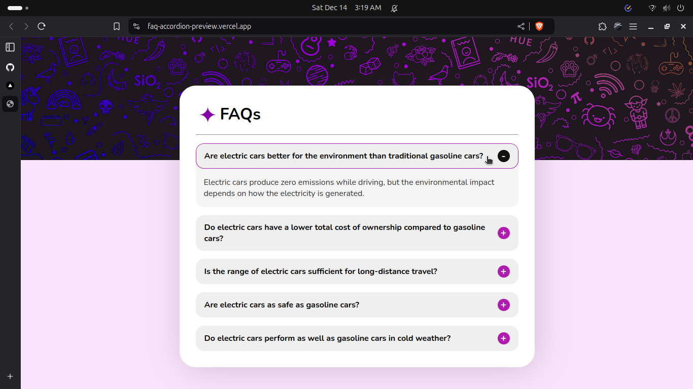
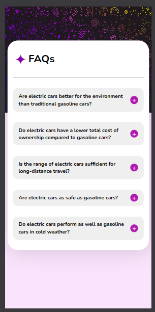

# Teach2Give Feb/Apr Technical Test

## Task 1: Algorithmic Thinking & Data Structures

Task implementation: [capitalize.js.](./task1-algorithmic-thinking/capitalize.js)

### How the algorithm scales with input size (Big-O Notation)
- Time Complexity: O(n), where n is the total number of characters in the input string. The algorithm makes a single pass to split the string, another to map and transform words, and a final pass to join them.

- Space Complexity: O(n), as it creates new arrays and strings during the transformation process. For very large inputs, this could be memory-intensive. A potential optimization for extremely large strings would be to use an in-place transformation with a character array, which could reduce space complexity to O(1) if implemented carefully. However, for most practical use cases, the current implementation provides a clean, readable, and efficient solution that balances performance with code clarity.

- The `map()` approach is particularly elegant as it handles the capitalization in a functional and concise manner, making the code easy to understand and maintain.

---

## Task 2: : Frontend Development Challenge: Simple FAQ Accordion

- Task implementation: [index.html](./task2-faq-accordion/index.html)
- Live preview: [https://faq-accordion-preview.vercel.app/](https://faq-accordion-preview.vercel.app/)
### Screenshots:

#### Desktop/Landscape View:

#### Mobile/Potratit View

